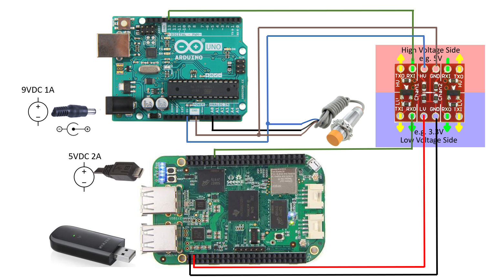

# GarageDoorStatus_BB_Flask

##  About and Motivation
This project uses a beaglebone to post status of garage door.

The open or closed status of garage door is determined by proximity switch.

The beaglebone is running a flask webserver with API.

I have raspberry pi that is running home-assistant. It reads garage door status posted by flask on the beaglebone.

This documents setting up the beaglebone to post garage door status.

This does not document setting up SSH, FTP and wifi on beaglebone.

This does not document setting up home-assistant on raspberry pi.

I want a smart garage door. Many of the existing products offer smart garage door but require a subscription. I want a solution that does not require a subscription. This project covers the "monitoring" half or implementing a smart garage door.

## Setup

Follow instructions with beaglebone to setup SSH and network.

The following python packages need to be installed on the beaglebone for the script to run:
- Flask
- Flask restful
- Adafruit_BBIO
 
Add this to cron
```
 @reboot sh /home/debian/launcher.sh >/home/debian/logs/cronlog 2>&1
 ```

 Add this to homeassistant configuration.yaml

 ```
sensor N
    - platform: rest
    name: GarageDoor
    resource: http://flask_web_server_ip:port/api_states
 ```
 replace N with the number you want to specify the sensor as
 replace flask_web_server_ip (and port) with the IP address (and port) of the beaglebone running flask web server
 
## Diagram of Setup



## Electronic Parts:

### BeagleBoneGreen
I added usb wifi dongle

### Arduino Uno

### Sparkfun logic level converter 
I have old uni-directional model

https://www.sparkfun.com/products/retired/8745?__hstc=77938635.99a265337744294b740e0787aea508c4.1563494400088.1563494400089.1563494400090.1&__hssc=77938635.1.1563494400091&__hsfp=1817143912

https://learn.sparkfun.com/tutorials/retired---using-the-logic-level-converter

newer one is bi-directional
https://www.sparkfun.com/products/12009


Proximity sensor
https://www.amazon.com/gp/product/B01M1777XK/ref=ppx_yo_dt_b_asin_title_o09_s00?ie=UTF8&psc=1


9VDC 1A power supply for arduino and prox sensor
https://www.amazon.com/enercell%C3%82%C2%AE-3-12vdc-adaptaplug-adapter-black/dp/b00dd0vyky

5.3VDC 2A power supply for beaglebone (extra smartphone charger I had)

## Hardware:

Projectbox 7.8 in. x 4.7 in. x 3 in.
https://www.amazon.com/gp/product/B07875F7YZ/ref=ppx_yo_dt_b_search_asin_title?ie=UTF8&psc=1

Aluminum plate from ace hardware store

plastic standoffs https://www.amazon.com/gp/product/B071KDS14D/ref=ppx_yo_dt_b_search_asin_title?ie=UTF8&psc=1

